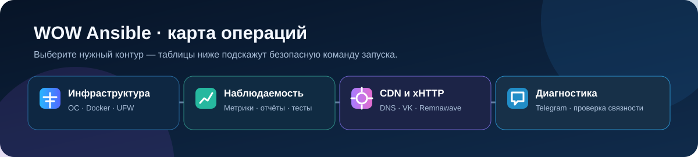

# WOW Ansible



**Операционная карта инфраструктуры WOW** — Ansible-сценарии для production
VPN-нод, RemnaNode, наблюдаемости и жизненного цикла CDN.

Ansible-репозиторий для эксплуатации Debian/Ubuntu-инфраструктуры WOW: базовая
подготовка серверов, RemnaNode, UFW, мониторинг и отчётность, а также жизненный
цикл CDN/xHTTP-фронтов. Последний контур управляет origin-декоями, DNS в
Cloudflare, ресурсами VK Cloud CDN, Remnawave и мониторами Uptime Kuma.

> Репозиторий выполняет изменения на production-хостах и во внешних API.
> Сначала запускайте сценарий на одной ноде через `--limit`, а разрушительные
> операции — только после предпросмотра.

## Содержание

- [Что здесь есть](#что-здесь-есть)
- [Карта всех playbook](#карта-всех-playbook)
- [Быстрый старт](#быстрый-старт)
- [Инвентарь и группы](#инвентарь-и-группы)
- [Секреты и локальные файлы](#секреты-и-локальные-файлы)
- [Основные playbook](#основные-playbook)
- [Контур CDN и xHTTP](#контур-cdn-и-xhttp)
- [Проверки и CI](#проверки-и-ci)
- [Эксплуатация и безопасность](#эксплуатация-и-безопасность)

## Что здесь есть

| Область | Компоненты | Назначение |
| --- | --- | --- |
| База | `bootstrap.yml` | Обновление Debian/Ubuntu, общие пакеты, Docker Engine/Compose, swap, sysctl, zsh и SSH-настройки. |
| VPN-ноды | `remnanode.yml`, `update_remnanode.yml`, `ufw.yml` | Развёртывание и обновление RemnaNode, настройка безопасного UFW. |
| Наблюдаемость | `monitoring.yml`, `reporting.yml`, `multitest.yml` | cAdvisor, node_exporter, vmagent, speedtest-метрики, Google Sheets и нагрузочные отчёты. |
| CDN-пул | `profile_inbounds_sync.yml`, `rotate_cdn.yml`, `panel_sync.yml`, `kuma_sync.yml` | Инбаунды CDN, ротация фронтов, Remnawave-балансер и Uptime Kuma. |
| Восстановление | `cdn_teardown.yml`, `rotate_cleanup.yml`, `find_orphans.py`, `cdn_watchdog.py` | Штатное удаление CDN-плеча, чистка незавершённых ротаций, поиск сирот и осторожная авторотация при HTTP 451. |
| Служебное | `test_domain.yml`, `squads_grant_slots.yml`, `tg_*.yml` | Проверка генерации доменов, выдача слотов сквадам, Telegram-диагностика. |

## Карта всех playbook

Все команды ниже запускаются из корня репозитория. Метки:
 —
обычная идемпотентная операция;
 —
сначала предпросмотр или `--limit`;
 —
производит заметные изменения либо удаление.

### База, VPN и наблюдаемость

| Playbook | Цели | Назначение | Старт |
| --- | --- | --- | --- |
|  `bootstrap.yml` | `all` | Обновляет ОС, ставит Docker/Speedtest, настраивает swap, sysctl/BBR, zsh, MOTD и SSH; reboot не выполняет. | `ansible-playbook playbook/bootstrap.yml --limit node_pl1` |
|  `remnanode.yml` | `docker_nodes` | Устанавливает стандартный Compose-стек RemnaNode в `/opt/remnanode`. | `ansible-playbook playbook/remnanode.yml --limit node_pl1` |
|  `ufw.yml` | `docker_nodes` | Настраивает SSH, клиентские порты и доступ панели к API, затем включает `deny incoming`. | `ansible-playbook playbook/ufw.yml --limit node_pl1` |
|  `monitoring.yml` | `all` | Разворачивает cAdvisor, node_exporter, vmagent и timer Speedtest. | `ansible-playbook playbook/monitoring.yml --limit node_pl1` |
|  `reporting.yml` | `all` | Собирает инвентарь и Speedtest, обновляет Google Sheets. | `ansible-playbook playbook/reporting.yml` |
|  `update_remnanode.yml` | `docker_nodes` | Последовательно обновляет Compose-образы; партия по умолчанию — 3 ноды. | `ansible-playbook playbook/update_remnanode.yml --limit node_pl1 -e batch_size=1` |
|  `multitest.yml` | `docker_nodes` | Нагрузочный CPU/disk/network-тест одной ноды; отчёт сохраняется в `reports/multitest/`. | `ansible-playbook playbook/multitest.yml --limit node_pl1` |
|  `site.yml` | `all` | Полный конвейер: bootstrap → RemnaNode → UFW → monitoring → reporting. | `ansible-playbook playbook/site.yml --limit node_pl1` |

### CDN, xHTTP и Remnawave

| Playbook | Цели | Назначение | Безопасный старт |
| --- | --- | --- | --- |
|  `xhttp_nginx.yml` | `eu_nodes` | Разворачивает origin-маскировку, nginx, backend, Let's Encrypt и, если включено, VK CDN + Cloudflare CNAME. | `ansible-playbook playbook/xhttp_nginx.yml --limit node_pl1` |
|  `test_domain.yml` | localhost | Проверяет генератор доменов; внешние ресурсы не создаёт. | `ansible-playbook playbook/test_domain.yml` |
|  `rotate_cdn.yml` | `eu_nodes` | Ротирует плечо: домены → origin → DNS/VK CDN → Remnawave → балансер → Kuma. | `ansible-playbook playbook/rotate_cdn.yml --limit node_pl1 -e cdn_dry_run=true` |
|  `panel_sync.yml` | `eu_nodes` | Синхронизирует CDN-хосты и балансер по активным state-файлам. | `ansible-playbook playbook/panel_sync.yml --limit node_pl1` |
|  `kuma_sync.yml` | `eu_nodes` | Создаёт или обновляет монитор актуального CDN-фронта. | `ansible-playbook playbook/kuma_sync.yml --limit node_pl1` |
|  `profile_inbounds_sync.yml` | localhost | Создаёт CDN_Pxx-инбаунды в профиле; push перезапускает Xray на нодах профиля. | `ansible-playbook playbook/profile_inbounds_sync.yml` |
|  `squads_grant_slots.yml` | localhost | Выдаёт CDN_Pxx внутренним сквадам, которым доступен эталонный `CDNVK`. | `ansible-playbook playbook/squads_grant_slots.yml` |
|  `node_inbounds_cleanup.yml` | `eu_nodes` | Находит лишние CDN_Pxx и снимает только неактуальные, неиспользуемые инбаунды. | `ansible-playbook playbook/node_inbounds_cleanup.yml --limit node_pl1` |
|  `rotate_cleanup.yml` | `eu_nodes` | Чистит DNS, VK CDN и origin брошенных ротаций; active-состояния не трогает. | `ansible-playbook playbook/rotate_cleanup.yml --limit node_pl1` |
|  `cdn_teardown.yml` | `eu_nodes` | Штатно удаляет активное CDN-плечо, DNS, VK-ресурс, origin, Kuma и state. | `ansible-playbook playbook/cdn_teardown.yml --limit node_pl1` |

### Telegram-диагностика

| Playbook | Назначение | Команда |
| --- | --- | --- |
| `tg_test.yml` | Проверяет доставку сообщения в настроенный чат или топик. | `ansible-playbook playbook/tg_test.yml` |
| `tg_report.yml` | Отправляет тестовый отчёт о CDN-ротации. | `ansible-playbook playbook/tg_report.yml` |
| `tg_dbg.yml` | Выводит распознанные `chat_id` и `thread_id`; токен не показывает. | `ansible-playbook playbook/tg_dbg.yml` |

> `multitest.yml` нагружает сервер. Для `apply=true`, `prune_images=true` и
> `remnawave_allow_empty_balancer=true` всегда сначала проверьте вывод
> предпросмотра и последствия операции.

## Быстрый старт

На управляющей машине требуются Python 3, Ansible, SSH-доступ и права `sudo`
на целевых хостах. Для CDN-операций также нужны `curl`, `jq`, `bash` и Python
зависимости локальных скриптов.

```bash
git clone <repository-url> WOW-ansible
cd WOW-ansible

python3 -m pip install --user ansible-core ansible-lint
ansible-galaxy collection install -r requirements.yml

cp inventory.yml.example inventory.yml
cp group_vars/docker_nodes.yml.example group_vars/docker_nodes.yml
mkdir -p logs reports/multitest playbook/secrets

ansible all -m ping
ansible-playbook playbook/bootstrap.yml --syntax-check
```

Конфигурация Ansible находится в `ansible.cfg`: по умолчанию используется
`inventory.yml`, роли загружаются из `roles/`, журнал пишется в `logs/ansible.log`.
Локальные inventory, секреты, отчёты, логи и состояние CDN исключены из Git.

Для проверки одной ноды добавляйте `--limit`:

```bash
ansible-playbook playbook/ufw.yml --limit node_pl1 --check --diff
```

`--check` не заменяет реальный запуск для задач, которые работают с Docker,
выпускают TLS-сертификаты, обращаются к API или используют `command`/`shell`.

## Инвентарь и группы

Создайте `inventory.yml` из `inventory.yml.example`. В репозитории используются
следующие группы:

| Группа | Для чего используется |
| --- | --- |
| `docker_panel` | Панели и вспомогательные Docker-хосты. |
| `docker_nodes` | VPN-ноды RemnaNode; к ним применяются RemnaNode и UFW. |
| `ru_nodes` | Подмножество VPN-нод с RU-профилем firewall. |
| `eu_nodes` | Ноды CDN-пула; на них работают ротация CDN и xHTTP-origin. |
| `xhttp_nodes` | Зарезервированная группа в тестовом inventory; сам `xhttp_nginx.yml` запускается по `eu_nodes`. |

Минимальный пример узла:

```yaml
docker_nodes:
  hosts:
    node_pl1:
      ansible_host: 203.0.113.21
      ansible_user: root
      monitoring_instance_name: node_pl1
      speedtest_provider: ookla
      domain: origin.example.com, front.example.com
      ufw_client_ports_override:
        - 1080

eu_nodes:
  hosts:
    node_pl1:
```

`monitoring_instance_name` — имя ноды в метриках; если его нет, используется
`inventory_hostname`. Для `xhttp_nginx.yml` и CDN-пула `domain` должен содержать
ровно два уникальных значения через запятую: сначала origin, затем CDN-фронт.
До выпуска сертификата origin-домен должен резолвиться на ноду, а `80` и `443`
должны быть свободны и доступны извне.

## Секреты и локальные файлы

Все пути ниже намеренно находятся в игнорируемом `playbook/secrets/`. Не
добавляйте ключи, токены, inventory или файлы состояния в коммиты.

| Интеграция | Файл / источник | Обязательные значения |
| --- | --- | --- |
| RemnaNode | `remnanode_secret_key` | Секретный ключ ноды Remnawave. |
| Remnawave API | `remnawave_token` | Bearer-токен панели для синхронизации CDN-пула. |
| vmagent | `vmagent.yml` | `vmagent_remote_write_url`, `vmagent_remote_write_username`, `vmagent_remote_write_password`. |
| Google Sheets | `google_sheet_id`, `google_credentials.json` | ID таблицы и JSON service account. Переменные окружения `GOOGLE_SHEET_ID` и `GOOGLE_CREDENTIALS_FILE` могут заменить файлы. |
| Cloudflare + VK Cloud | `.env` | Скопируйте `playbook/scripts/.env.example`; потребуются OpenStack/VK Cloud и Cloudflare account token с Zone Read/DNS Write. |
| Uptime Kuma | `kuma.env` | `KUMA_URL`, `KUMA_USER`, `KUMA_PASS`. |
| Telegram | `telegram.env` | `TELEGRAM_BOT_TOKEN`, `TELEGRAM_CHAT_ID`; опционально `TELEGRAM_THREAD_ID`. |

Подготовка CDN-credentials:

```bash
cp playbook/scripts/.env.example playbook/secrets/.env
chmod 600 playbook/secrets/.env
```

В `group_vars/xhttp_nodes.yml` по умолчанию уже указан именно путь
`playbook/secrets/.env`. Не сохраняйте OpenStack RC-файлы рядом с репозиторием
без необходимости: `*openrc.sh` также игнорируется Git.

Для отчётности в Google Sheets на управляющей машине потребуются библиотеки:

```bash
python3 -m pip install --user google-api-python-client google-auth
```

Для Uptime Kuma создайте виртуальное окружение, которое по умолчанию ожидает
роль `kuma`:

```bash
python3 -m venv .venv
.venv/bin/pip install 'python-socketio[client]'
```

## Основные playbook

Все команды выполняются из корня репозитория.

| Playbook | Цели | Что делает | Пример запуска |
| --- | --- | --- | --- |
| `bootstrap.yml` | `all` | Базовая подготовка ОС и Docker. Не перезагружает сервер, но сообщает о необходимости reboot. | `ansible-playbook playbook/bootstrap.yml --limit node_pl1` |
| `remnanode.yml` | `docker_nodes` | Устанавливает стандартный RemnaNode в `/opt/remnanode`. | `ansible-playbook playbook/remnanode.yml --limit docker_nodes` |
| `ufw.yml` | `docker_nodes` | Настраивает SSH, клиентские порты и доступ панели к `NODE_PORT`; включает `deny incoming`. | `ansible-playbook playbook/ufw.yml --limit node_pl1` |
| `monitoring.yml` | `all` | Разворачивает cAdvisor, node_exporter, vmagent и timer speedtest. | `ansible-playbook playbook/monitoring.yml --limit node_pl1` |
| `reporting.yml` | `all` | Собирает инвентарь и speedtest в Google Sheets; вкладка по умолчанию `ansible_inventory`. | `ansible-playbook playbook/reporting.yml` |
| `update_remnanode.yml` | `docker_nodes` | Последовательно обновляет Compose-образы. По умолчанию партия — 3 ноды. | `ansible-playbook playbook/update_remnanode.yml -e batch_size=1` |
| `multitest.yml` | `docker_nodes` | Нагрузочный тест строго по одной ноде; копирует отчёты в `reports/multitest/`. | `ansible-playbook playbook/multitest.yml --limit node_pl1` |
| `site.yml` | `all` | Полный конвейер: bootstrap → RemnaNode → UFW → monitoring → reporting. | `ansible-playbook playbook/site.yml` |

### RemnaNode

Playbook устанавливает единый стандартный стек RemnaNode. Для подключения ноды
требуется файл `playbook/secrets/remnanode_secret_key`.
Обновление без удаления неиспользуемых Docker-образов:

```bash
ansible-playbook playbook/update_remnanode.yml --limit docker_nodes
```

Удалять неиспользуемые образы разрешено только явным флагом:

```bash
ansible-playbook playbook/update_remnanode.yml -e prune_images=true
```

### UFW

Перед первым запуском укажите реальные IP панелей в локальном
`group_vars/docker_nodes.yml`:

```yaml
ufw_panel_ips:
  - "198.51.100.10"
  - "198.51.100.11"
```

Роль находит SSH-порты и `NODE_PORT` из Compose, открывает клиентские порты,
а API-ноды разрешает только адресам панелей. При первом боевом запуске оставьте
открытым активный SSH-сеанс, используйте одну ноду и убедитесь, что адрес
управляющей панели указан верно.

## Контур CDN и xHTTP

Этот набор сценариев связывает состояние в `playbook/state/<node>.json` с DNS,
VK Cloud, Remnawave и Kuma. Состояние хранится на управляющей машине, имеет
права `0600` и не коммитится. Не удаляйте его во время активной ротации.

### Первичная подготовка

1. Настройте `eu_nodes`, пары доменов и локальные secrets.
2. Разверните origin/xHTTP-сайты:

   ```bash
   ansible-playbook playbook/xhttp_nginx.yml --limit node_pl1
   ```

   Playbook выбирает статический cover-сайт детерминированно, настраивает nginx
   в `/opt/remnanode/nginx`, получает Let's Encrypt сертификат и после успеха
   локально запускает `scripts/setup-cdn.sh`. Если CDN временно не требуется,
   передайте `-e xhttp_cdn_setup_enabled=false`.

3. Создайте CDN-инбаунды в конфиг-профиле Remnawave. Этот шаг может перезапустить
   Xray на всех нодах профиля, поэтому сначала используйте предпросмотр, затем
   окно низкой нагрузки:

   ```bash
   ansible-playbook playbook/profile_inbounds_sync.yml
   ansible-playbook playbook/profile_inbounds_sync.yml -e apply=true
   ```

4. Выдайте новые `CDN_Pxx` внутренним сквадам, иначе пользователи не получат
   хосты в подписке:

   ```bash
   ansible-playbook playbook/squads_grant_slots.yml
   ansible-playbook playbook/squads_grant_slots.yml -e apply=true
   ```

### Ротация и синхронизация

| Сценарий | Безопасный запуск | Применение / результат |
| --- | --- | --- |
| Проверить генератор доменов | `ansible-playbook playbook/test_domain.yml` | Ничего внешнего не создаёт (`cdn_dry_run=true`). |
| Ротировать один CDN-фронт | `ansible-playbook playbook/rotate_cdn.yml --limit node_pl1 -e cdn_dry_run=true` | Уберите `cdn_dry_run=true` для создания DNS, origin, ресурса CDN, хоста и балансера. |
| Продолжить прерванную ротацию | — | `ansible-playbook playbook/rotate_cdn.yml --limit node_pl1 -e cdn_resume=true` |
| Синхронизировать панель | — | `ansible-playbook playbook/panel_sync.yml --limit node_pl1` создаёт/чинит CDN-хост и балансер по state-файлу. |
| Синхронизировать Kuma | — | `ansible-playbook playbook/kuma_sync.yml --limit node_pl1` переносит монитор на актуальный фронт. |
| Очистить брошенную ротацию | `ansible-playbook playbook/rotate_cleanup.yml --limit node_pl1` | Добавьте `-e apply=true` только после проверки списка удаляемых DNS/VK-ресурсов/каталога сайта. |
| Удалить текущее CDN-плечо | `ansible-playbook playbook/cdn_teardown.yml --limit node_pl1` | Добавьте `-e apply=true` для удаления ресурсов, DNS, origin-каталога, хоста Remnawave и монитора Kuma. |

При ручной `rotate_cdn.yml` предыдущее плечо по умолчанию остаётся включённым.
Для авторотации `cdn_watchdog.py` устанавливает `auto_trigger=true`, и прежнее
плечо снимается автоматически по завершении.

### Штатное удаление CDN-плеча

`cdn_teardown.yml` удаляет текущее плечо, описанное в
`playbook/state/<node>.json`. В предпросмотре он показывает точные домены и
UUID хоста, но не обращается к изменяющим API. Перед боевым запуском всегда
проверьте этот вывод:

```bash
ansible-playbook playbook/cdn_teardown.yml --limit node_pl1
ansible-playbook playbook/cdn_teardown.yml --limit node_pl1 -e apply=true
```

В боевом режиме сценарий удаляет UUID из балансера и хост из Remnawave, VK CDN
resource, его CNAME в Cloudflare, A-запись origin, каталог origin на ноде,
монитор Uptime Kuma и state-файл. Операция идемпотентна: повторный запуск
дочищает уже частично удалённое плечо.

По умолчанию нельзя удалить последнее плечо балансера — это защитит подписку от
перехода в fallback. Если это сознательное полное отключение CDN, добавьте
отдельный явный флаг:

```bash
ansible-playbook playbook/cdn_teardown.yml --limit node_pl1 \
  -e apply=true -e remnawave_allow_empty_balancer=true
```

VK origin group не удаляется автоматически: группа может быть общей у нескольких
CDN-ресурсов. После полного teardown проверьте такие группы в VK Cloud и
удаляйте только подтверждённо неиспользуемые.

### Kuma, Telegram и watchdog

`kuma_cli.py` — локальный CLI Uptime Kuma, использующий socket.io:

```bash
.venv/bin/python playbook/scripts/kuma_cli.py list
.venv/bin/python playbook/scripts/kuma_cli.py status --parent 18 --prefix 'CDN '
ansible-playbook playbook/tg_test.yml
```

`cdn_watchdog.py` реагирует именно на подтверждённый HTTP 451: нужны два
последовательных срабатывания, действуют cooldown и дневной бюджет. Обычные
SSL/timeout/5xx приводят к алерту, но не к ротации. Перед включением systemd
таймера проверьте логику безопасно:

```bash
python3 playbook/scripts/cdn_watchdog.py --dry-run --verbose
```

Стоп-кран авторотации — файл `playbook/state/AUTOROTATE_OFF`. Он отключает
только watchdog; ручные запуски `rotate_cdn.yml` продолжат работать.

Скрипты `cdn_watchdog.py` и `find_orphans.py` рассчитаны на развёрнутый
контроллер в `/root/ansible`. Если репозиторий расположен в другом месте,
перед их использованием скорректируйте константы путей в самих скриптах.
`find_orphans.py` без аргументов только выводит сиротские A/CNAME; переданные
ему домены удаляются из Cloudflare.

## Проверки и CI

Установите те же зависимости, что использует CI, и выполните:

```bash
ansible-galaxy collection install -r requirements.yml
ansible-lint

find playbook -maxdepth 1 -type f -name '*.yml' -print0 | sort -z |
  xargs -0 -n 1 ansible-playbook \
    --inventory tests/inventory.yml \
    --syntax-check
```

GitHub Actions в `.github/workflows/ansible-validate.yml` запускается на push
и PR в `main` и не подключается к production inventory. После push в `main`
workflow отправляет итог проверки в Telegram через Repository secrets:
`TELEGRAM_BOT_TOKEN`, `TELEGRAM_CHAT_ID` и опциональный `TELEGRAM_THREAD_ID`.
Для PR, включая PR из форков, Telegram secrets не используются. Проверка
называется **Lint and syntax check** — её следует выбрать обязательной в GitHub
Ruleset для `main` после первого успешного прогона.

В `.ansible-lint` исторические style-замечания временно имеют уровень warning.
Ошибки синтаксиса, схем, отсутствующих модулей и остальные неослабленные правила
по-прежнему делают CI красным. Новые предупреждения стоит устранять постепенно,
а не расширять список исключений без причины.

## Эксплуатация и безопасность

- Не запускайте `site.yml` до подготовки всех secrets: он включает отчётность
  Google Sheets после настройки инфраструктуры.
- Для UFW, обновлений, ротации CDN, teardown и cleanup всегда начинайте с одной ноды.
- Не передавайте токены через `-e` или командную строку: они могут попасть в
  shell history, process list или CI-логи.
- Перед `rotate_cleanup.yml -e apply=true` сохраняйте вывод предпросмотра.
- Перед `cdn_teardown.yml -e apply=true` сохраняйте вывод предпросмотра; флаг
  `remnawave_allow_empty_balancer=true` используйте только для осознанного
  отключения последнего CDN-плеча.
- `playbook/state/`, `reports/`, `logs/` и резервные `*.bak.*` — локальные
  эксплуатационные артефакты. Храните резервную копию state-файлов вне Git.
- Скрипты в `failover_db/` относятся к ручным процедурам failover Remnawave DB;
  сначала прочитайте `failover_db/remnawave-ha-cheatsheet.md` и не запускайте
  их автоматически из Ansible.

## Структура репозитория

```text
playbook/       Основные сценарии, шаблоны, файлы и локальные scripts
roles/          Переиспользуемые роли: remnawave, cdn_domain, cdn_state, kuma,
                telegram, ufw_firewall, xhttp_origin
group_vars/     Общие настройки групп и локальные overrides
tests/          Непроизводственный inventory для syntax check в CI
failover_db/    Ручные инструкции и скрипты HA/failover базы Remnawave
```
